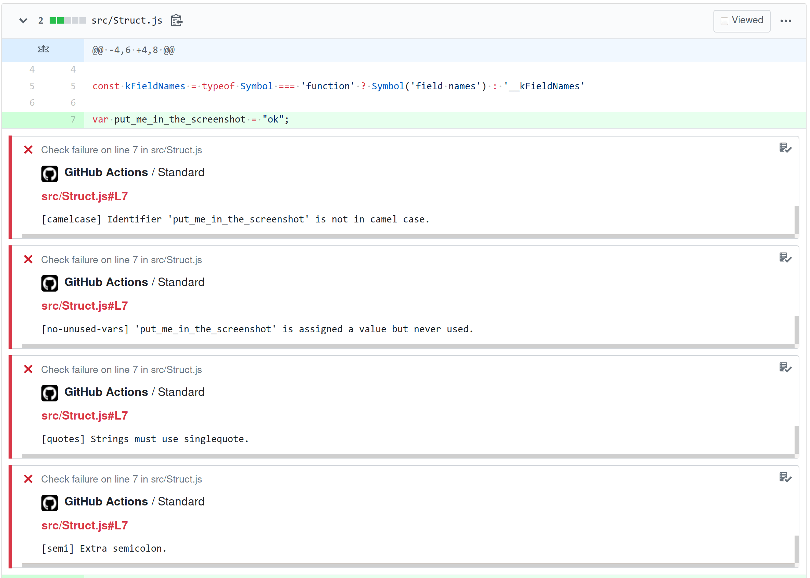

> :warning: Archived

This action's purpose was to provide linting annotations in PRs. Github now provides that feature by default, so you do not need this.

Instead of this action, use:

```yaml
jobs:
  lint:
    runs-on: ubuntu-latest
    steps:
      - uses: actions/checkout@v2
      # This sets up a "problem matcher" for eslint and standard
      - uses: actions/setup-node@v2
      # Now you can just run eslint or standard yourself
      - run: npx standard
```

The old readme is archived below.

---

# standard-action

Github Action to lint with &#x60;standard&#x60;

[Usage](#usage) - [License: Apache-2.0](#license)



## Usage

In a Github Actions workflow file, do something like:

```yaml
jobs:
  lint:
    runs-on: ubuntu-latest
    steps:
      - uses: actions/checkout@v2
      - uses: goto-bus-stop/standard-action@v1
        with:
          # optionally select a different, standard-like linter
          # linter: semistandard

          # optionally select a different eslint formatter for the log output, default 'stylish'
          # formatter: tap

          # limit the files to lint, default '**/*.js'
          # files: src/*.js

          # show errors in the the github diff UI
          annotate: true

        # Allow the action to add lint errors to the github diff UI
        env:
          GITHUB_TOKEN: ${{secrets.GITHUB_TOKEN}}
```

To use a different linter than `standard`, or use a specific version of `standard`, add it as a devDependency to your project, and run `npm install` in your workflow so the action can `require()` it.

```yaml
- uses: actions/checkout@v2
- uses: actions/setup-node@v1
- run: npm install
- uses: goto-bus-stop/standard-action@v1
  with:
    linter: semistandard
```

If you do not install any linter yourself, this action will use Standard v14.

## Multiple globs

`with.files` must contain a string, so to pass multiple globs, you need to use a single glob string:
```yaml
- uses: goto-bus-stop/standard-action@v1
  with:
    files: '{src/**/*.js,test/**/*.js}'
```

## License

[Apache-2.0](LICENSE.md)
